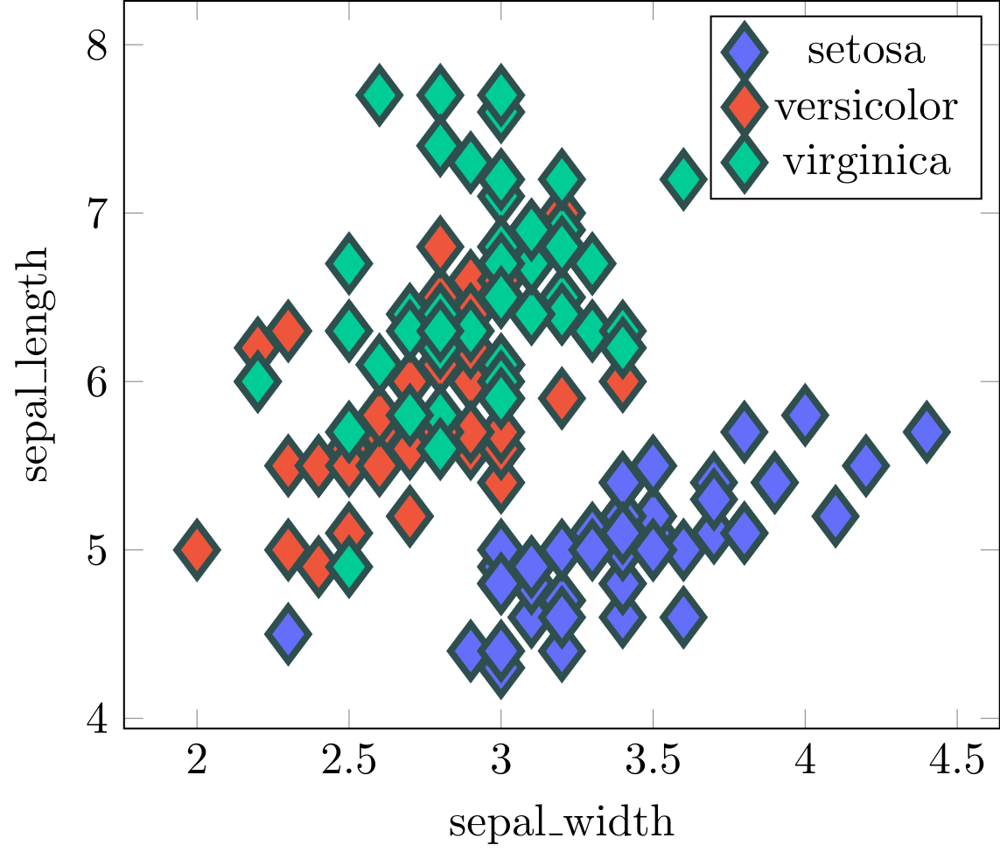

# Other features supported


## Marker style

From [Styling Markers in Python](https://plotly.com/python/marker-style/).

```python
import plotly.express as px
import tikzplotly

df = px.data.iris()
fig = px.scatter(df, x="sepal_width", y="sepal_length", color="species")

fig.update_traces(
    marker=dict(size=8, symbol="diamond", line=dict(width=2, color="DarkSlateGrey")),
    selector=dict(mode="markers"),
)

tikzplotly.save("marker_style.tex", fig)
```


