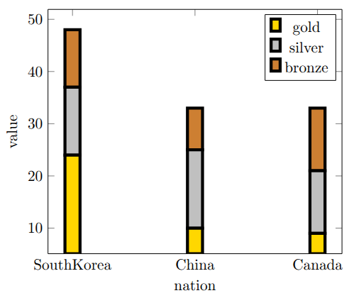
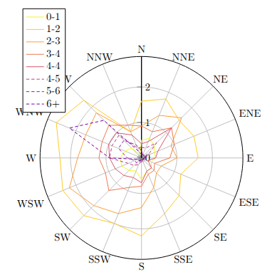
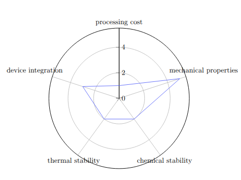
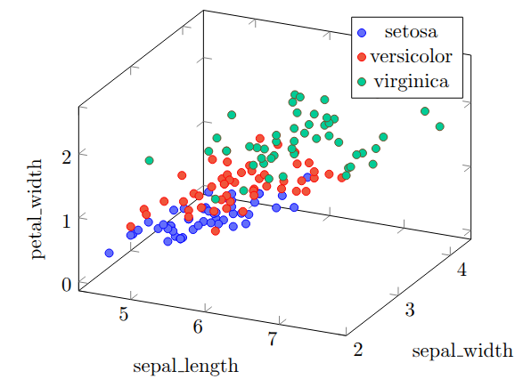

# Supported plots

The plots type supported by tikzplotly are presented in this page.


## Scatter plots

The code has been constructed to export (almost all) the figures of the page [Line Charts in Python](https://plotly.com/python/line-charts/) of Plotly documentation.

??? example "Scatter plot Example"

    ```python
    import plotly.express as px
    import tikzplotly

    df = px.data.gapminder().query("continent=='Oceania'")
    fig = px.line(df, x="year", y="lifeExp", color='country')

    tikzplotly.save("line.tex", fig)
    ```
    


## Heat maps

The code has been constructed to export (almost all) the figures of the page [Heatmaps in Python](https://plotly.com/python/heatmaps/) of Plotly documentation.

??? example "Heatmap Example"
    ```python
    import plotly.express as px
    import tikzplotly
    fig = px.imshow([[1, 20, 30],
                    [20, 1, 60],
                    [30, 60, 1]])
    tikzplotly.save("heatmap.tex", fig)
    ```

    

!!! Note
    - If possible, TikzPlotly try to save the heatmap as a png of the smallest size possible, namely 1 pixel for each value of the heatmap. But in some case, such export does not work. In this case, the image is saved in the original size of the Plotly figure.


## Histograms

The examples of the page [Histograms in Python](https://plotly.com/python/histograms/) of Plotly documentation are supported.

??? example "Histogram Example"
    ```python
    df = px.data.tips()
    fig = px.histogram(df, x="total_bill")
    tikzplotly.save("histogram.tex", fig)
    ```

    

!!! Note
    - There may be issues when many histograms are plotted on the same figure...


## Bar plots

Some examples of the page [Bar Charts in Python](https://plotly.com/python/bar-charts/) of Plotly documentation are supported (not stacked and aggregated bars).

??? example "Bar plot"
    ```python
    wide_df = px.data.medals_wide()
    fig = px.bar(
        wide_df,
        x="nation",
        y=["gold", "silver", "bronze"],
        color_discrete_map = {"gold": "gold", "silver": "silver", "bronze": "#cd7f32"}
    )
    fig.update_traces(marker_line_width=2, marker_line_color="black")
    tikzplotly.save("bar.tex", fig)
    ```
    


## Polar and radar plots

The examples from the pages [Polar Charts in Python](https://plotly.com/python/polar-chart/) and [Radar Charts in Python](https://plotly.com/python/radar-chart/) are supported.


??? example "Polar plot"
    ```python
    df = px.data.wind()
    fig = px.line_polar(df, r="frequency", theta="direction", color="strength", line_close=True,
                        color_discrete_sequence=px.colors.sequential.Plasma_r,
                        template="plotly_dark",)
    tikzploylt.save("polar.tex", fig)
    ```
    


??? example "Radar plot"
    ```python
    df = pd.DataFrame(dict(
        r=[1, 5, 2, 2, 3],
        theta=['processing cost','mechanical properties','chemical stability',
            'thermal stability', 'device integration']))
    fig = px.line_polar(df, r='r', theta='theta', line_close=True)
    tikzploylt.save("radar.tex", fig)
    ```
    


## 3D scatter plots

Examples from [3D Scatter Plots in Python ](https://plotly.com/python/3d-scatter-plots/) can be exported with tikzplotly.


??? example "3D scatter plot"
    ```python
    df = px.data.iris()
    fig = px.scatter_3d(df, x='sepal_length', y='sepal_width', z='petal_width', color='species')
    tikzploylt.save("scatter3d.tex", fig)
    ```
    
